<div align="center">

# 🏰 Azure Active Directory Domain Controller — Terraform Deployment Lab


**I deployed a fully functional Windows Server 2022 Active Directory Domain Controller on Azure using Terraform — automating every layer of infrastructure provisioning and AD DS configuration through a Custom Script Extension that installs the AD DS role, promotes the server to a new forest, and configures integrated DNS in a single `terraform apply`.**

[Overview](#-overview) • [Architecture](#-architecture) • [Environment](#-lab-environment) • [Phase Walkthrough](#-phase-walkthrough) • [Skills](#-skills-demonstrated) • [Career Relevance](#-career-relevance)

</div>

---

## 📋 Lab Summary

| Field | Detail |
|---|---|
| **Certification Alignment** | AZ-104 · AZ-500 · HashiCorp Terraform Associate |
| **Estimated Time** | 2–3 hours |
| **Estimated Cost** | ~$1–2 (Standard_D2s_v3 VM, destroyed after lab) |
| **Difficulty** | Intermediate |
| **Platform** | Microsoft Azure · Terraform CLI · macOS |
| **Career Relevance** | Cloud Engineer · Azure Administrator · Infrastructure Engineer · DevOps Engineer |

---

## 🎯 Overview

Manual Active Directory deployments are slow, error-prone, and impossible to reproduce consistently. In enterprise environments, domain controllers must be provisioned through repeatable infrastructure-as-code pipelines — ensuring every deployment is identical, auditable, and version-controlled.

In this lab I eliminated every manual step from the AD DS deployment process by codifying the entire infrastructure stack in Terraform:

- **I wrote four Terraform configuration files** — `main.tf`, `variables.tf`, `outputs.tf`, and `terraform.tfvars` — defining every Azure resource from the VNet to the Custom Script Extension
- **I provisioned the complete Azure network stack** — VNet, subnet, static public IP, NSG with RDP allow rule, and NIC with a static private IP at `10.0.1.4` (required for DNS stability on a domain controller)
- **I deployed a Windows Server 2022 VM** on `Standard_D2s_v3` with a 127 GB Premium SSD, fully defined in code
- **I automated AD DS installation and forest promotion** via a Custom Script Extension running a single PowerShell command — no RDP required during provisioning
- **I verified the deployment** by connecting via RDP as a domain user (`CORP\adadmin`), confirming AD DS and DNS roles in Server Manager, and running four PowerShell verification commands against the live domain
- **I managed sensitive values securely** — passwords and domain credentials stored in `terraform.tfvars`, excluded from version control via `.gitignore`

> Terraform is the industry-standard IaC tool for Azure infrastructure provisioning. This lab demonstrates the ability to translate infrastructure requirements into code, manage state, and automate complex multi-step deployments — directly applicable to Cloud Engineer, Azure Administrator, and DevOps roles.

---

## 🏗 Architecture

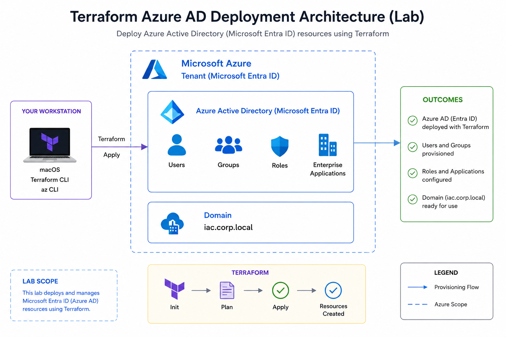

```
┌──────────────────────────────────────────────────────────────────────────────┐
│                         AZURE SUBSCRIPTION (KINGSRULE50)                     │
│                                                                              │
│  ┌────────────────────────────────────────────────────────────────────────┐  │
│  │                    RESOURCE GROUP: rg-ad-chinedu (East US)             │  │
│  │                                                                        │  │
│  │  ┌─────────────────────────────────────────────────────────────────┐   │  │
│  │  │              VNet: vnet-ad-chinedu (10.0.0.0/16)                │   │  │
│  │  │                                                                 │   │  │
│  │  │   ┌──────────────────────────────────────────────────────────┐  │   │  │
│  │  │   │           Subnet: snet-ad (10.0.1.0/24)                  │  │   │  │
│  │  │   │                                                          │  │   │  │
│  │  │   │   ┌────────────────────────────────────────────────┐     │  │   │  │
│  │  │   │   │         VM: vm-ad-chinedu                      │     │  │   │  │
│  │  │   │   │         Windows Server 2022 Datacenter         │     │  │   │  │
│  │  │   │   │         Standard_D2s_v3 · 127 GB Premium SSD   │     │  │   │  │
│  │  │   │   │                                                │     │  │   │  │
│  │  │   │   │  NIC: nic-ad-chinedu                           │     │  │   │  │
│  │  │   │   │  Private IP: 10.0.1.4 (Static)                │     │  │   │  │
│  │  │   │   │  Public IP: pip-ad-chinedu (Static)            │     │  │   │  │
│  │  │   │   │                                                │     │  │   │  │
│  │  │   │   │  ┌──────────────────────────────────────────┐  │     │  │   │  │
│  │  │   │   │  │   Custom Script Extension                │  │     │  │   │  │
│  │  │   │   │  │   install-ad-ds                          │  │     │  │   │  │
│  │  │   │   │  │   Install-WindowsFeature AD-Domain-Svc   │  │     │  │   │  │
│  │  │   │   │  │   Install-ADDSForest corp.chinedu.com    │  │     │  │   │  │
│  │  │   │   │  │   DNS: Integrated · DSRM: Configured     │  │     │  │   │  │
│  │  │   │   │  └──────────────────────────────────────────┘  │     │  │   │  │
│  │  │   │   └────────────────────────────────────────────────┘     │  │   │  │
│  │  │   └──────────────────────────────────────────────────────────┘  │   │  │
│  │  └─────────────────────────────────────────────────────────────────┘   │  │
│  │                                                                        │  │
│  │  NSG: nsg-ad-chinedu                                                   │  │
│  │  Inbound Rule: allow-rdp · Port 3389 · TCP · Priority 1000            │  │
│  └────────────────────────────────────────────────────────────────────────┘  │
│                                                                              │
│  Domain: corp.chinedu.com · NetBIOS: CORP · Forest Mode: WinThreshold       │
│  Domain Admin: CORP\adadmin · PDC Emulator: ad-chinedu.corp.chinedu.com     │
└──────────────────────────────────────────────────────────────────────────────┘

TERRAFORM FLOW
macOS (Terraform CLI + az CLI)
  → terraform init   (download azurerm provider ~> 3.0)
  → terraform plan   (9 resources to add)
  → terraform apply  (deploy + AD DS install: ~10 min)
  → terraform output (public IP, domain name, admin username)
```

---

## 🖥 Lab Environment

| Component | Detail |
|---|---|
| **Workstation** | Intel MacBook Pro · macOS · Terraform CLI · Azure CLI |
| **Azure Subscription** | Microsoft Azure Developer Tenant (KINGSRULE50) |
| **Resource Group** | rg-ad-chinedu — East US |
| **VM** | vm-ad-chinedu — Windows Server 2022 Datacenter |
| **VM Size** | Standard_D2s_v3 (2 vCPUs, 8 GB RAM) |
| **OS Disk** | 127 GB Premium SSD (Premium_LRS) |
| **Network** | vnet-ad-chinedu / snet-ad · 10.0.0.0/16 / 10.0.1.0/24 |
| **Static Private IP** | 10.0.1.4 (required for DC DNS stability) |
| **Domain** | corp.chinedu.com · NetBIOS: CORP |
| **Forest/Domain Mode** | WinThreshold (Windows Server 2016) |
| **IaC Tool** | Terraform v1.3+ · azurerm provider ~> 3.0 |
| **Cost** | ~$1–2 (VM destroyed after lab) |

### Terraform File Structure

| File | Purpose |
|---|---|
| `main.tf` | All Azure resource definitions + Custom Script Extension |
| `variables.tf` | Input variable declarations with types and defaults |
| `outputs.tf` | Public IP, domain name, admin username outputs |
| `terraform.tfvars` | Variable values — excluded from Git via `.gitignore` |
| `.gitignore` | Excludes `terraform.tfvars`, `.terraform/`, state files |

---

## 🛠️ Phase Walkthrough

### Phase 1 — Project Scaffold & Terraform Configuration

I created the project directory and all four Terraform files, then populated each with the full configuration. The VS Code explorer confirms the complete file structure before any Terraform commands were run — `main.tf`, `variables.tf`, `outputs.tf`, `terraform.tfvars`, `.gitignore`, and the `.terraform.lock.hcl` generated by `terraform init`.

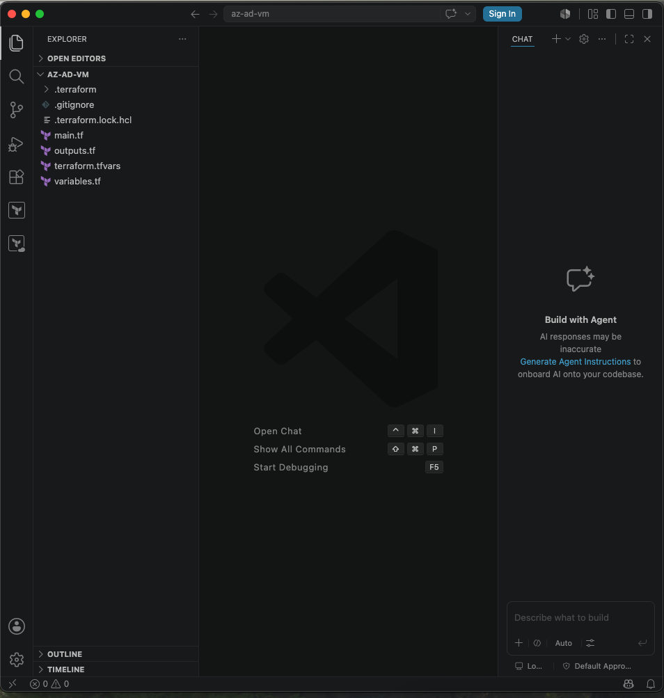

I stored all sensitive values — VM admin password, DSRM password, domain name, and personal name suffix — in `terraform.tfvars` and added it to `.gitignore` immediately, ensuring credentials were never committed to version control. The `main.tf` references all values through variables using `${var.yourname}` interpolation, making the configuration fully reusable.

---

### Phase 2 — Terraform Plan

I ran `terraform plan` to validate the configuration and preview the exact resources Terraform would create. The plan confirmed 9 resources to add across the full Azure network and compute stack.

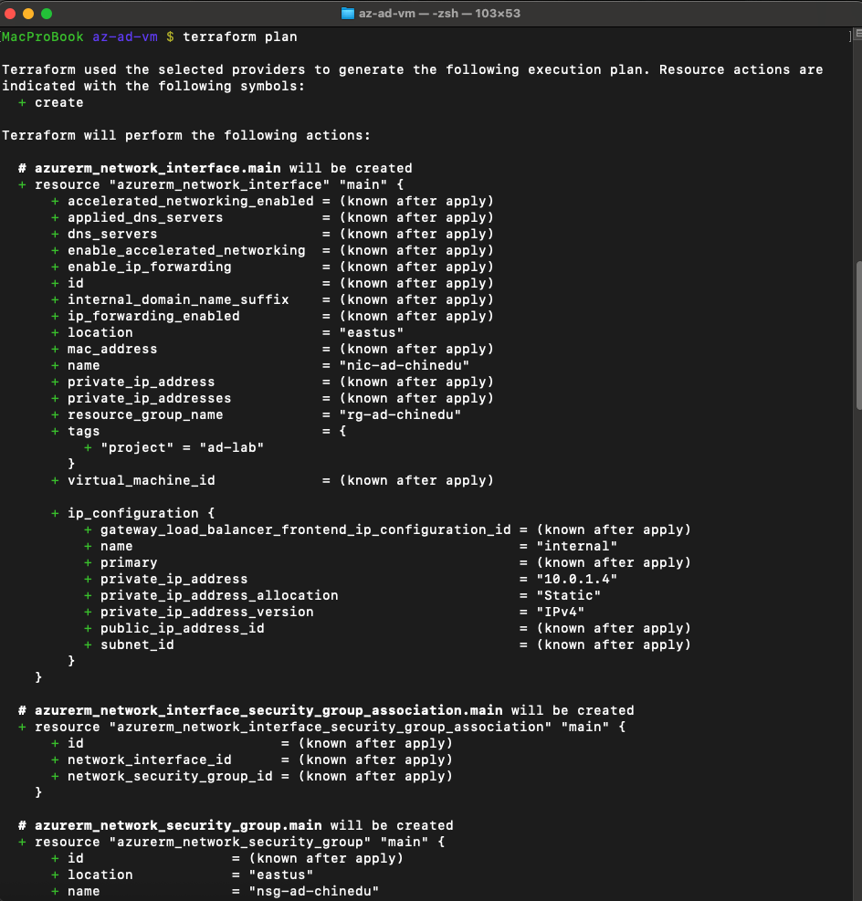

The plan output shows the NIC resource with `private_ip_address = "10.0.1.4"` and `private_ip_address_allocation = "Static"` — confirming the static IP assignment is correctly coded. I used a static private IP deliberately: domain controllers require a fixed IP address so DNS records remain stable after reboots.

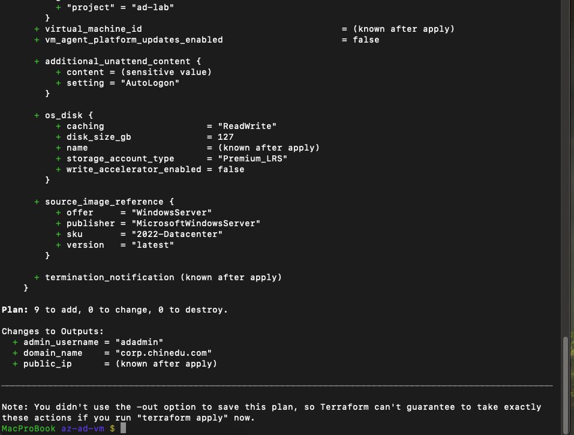

The plan summary confirms `Plan: 9 to add, 0 to change, 0 to destroy` with all three outputs pre-calculated — `admin_username`, `domain_name`, and `public_ip` shown as known after apply. Zero changes and zero destructions confirms a clean initial deployment with no state drift.

---

### Phase 3 — Terraform Apply

I ran `terraform apply`, typed `yes` at the confirmation prompt, and let Terraform provision the full stack. The Custom Script Extension — which installs AD DS and promotes the server to a domain controller — ran for 9 minutes and 8 seconds before completing successfully.

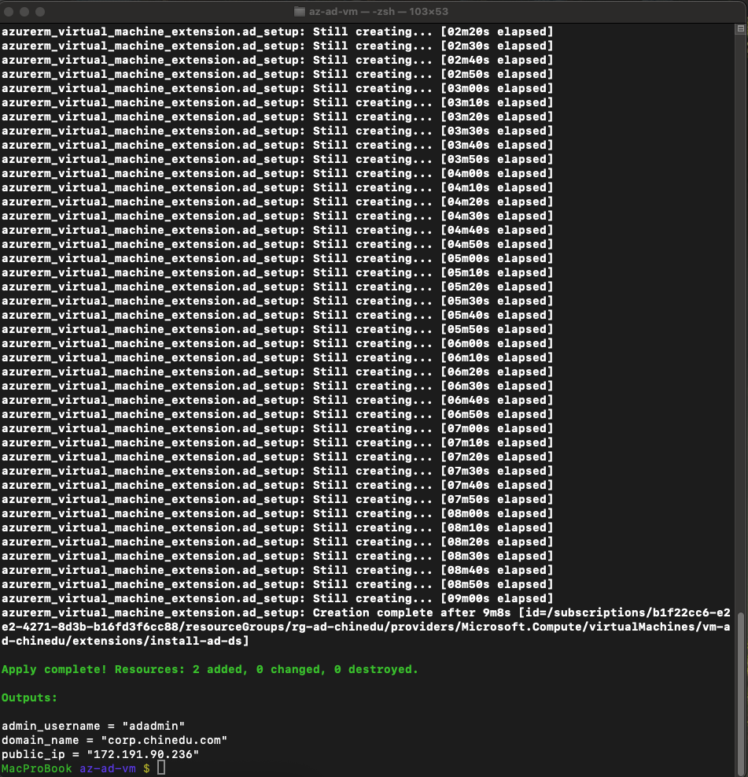

The apply output confirms `Apply complete! Resources: 2 added, 0 changed, 0 destroyed` with all three outputs rendered: `admin_username = "adadmin"`, `domain_name = "corp.chinedu.com"`, and `public_ip = "172.191.90.236"`. The Custom Script Extension resource ID confirms the extension was provisioned against `vm-ad-chinedu` in `rg-ad-chinedu`.

---

### Phase 4 — Azure Portal Verification

#### Resource Group Overview

I navigated to `rg-ad-chinedu` in the Azure Portal to confirm all resources were provisioned exactly as defined in Terraform. The resource group shows all 6 resources: NIC, NSG, Public IP, VM, OS Disk, and VNet — tagged with `project: ad-lab` confirming the tags variable propagated correctly.

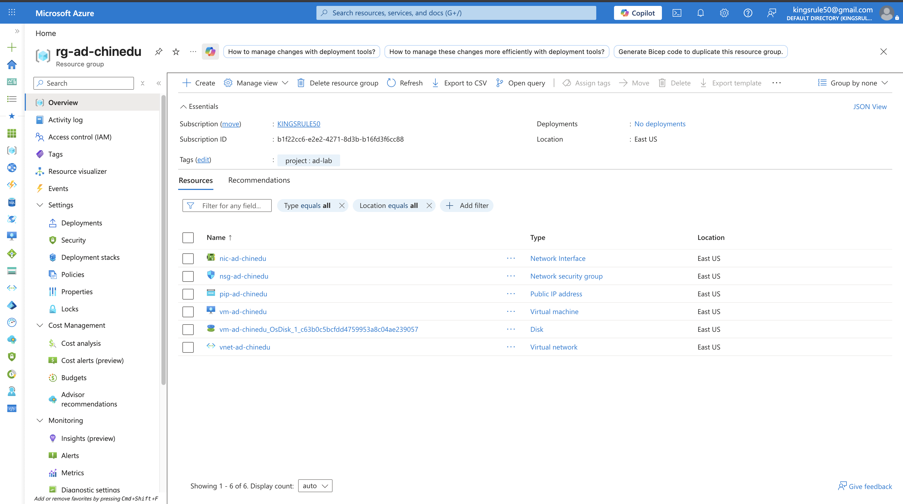

#### NSG Inbound Security Rules

I opened `nsg-ad-chinedu` and navigated to Inbound security rules to confirm the RDP allow rule was created as coded. The `allow-rdp` rule is visible at Priority 1000 with Port 3389, TCP, Source Any, Action Allow.

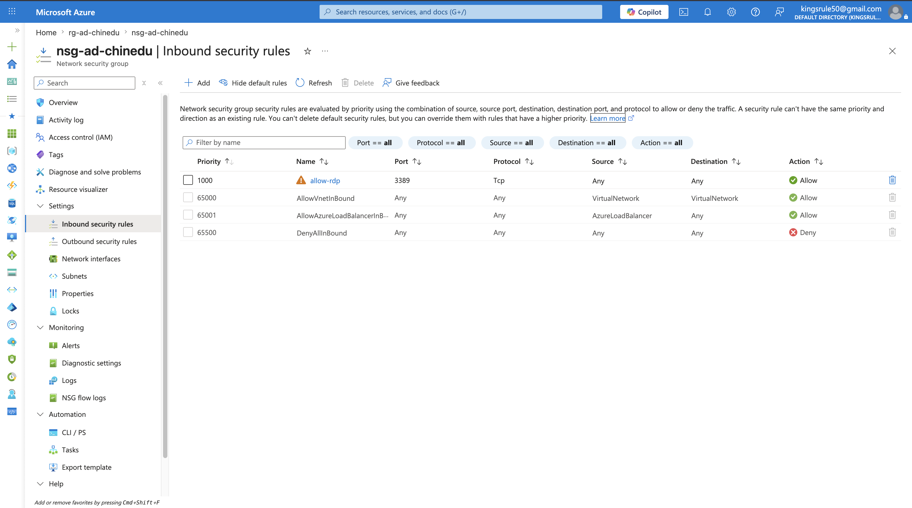

The warning triangle on `allow-rdp` is Azure flagging the rule as open to the internet — expected and intentional for a lab environment where RDP access is required. In a production deployment this would be scoped to a specific source IP or replaced with Azure Bastion.

#### NIC Static IP Configuration

I opened `nic-ad-chinedu` to confirm the static private IP assignment. The Properties view shows both IP configuration panels simultaneously: Private IPv4 address `10.0.1.4`, Private IP allocation method **Static**, and Public IPv4 address `172.191.90.236` — matching the terraform output exactly.

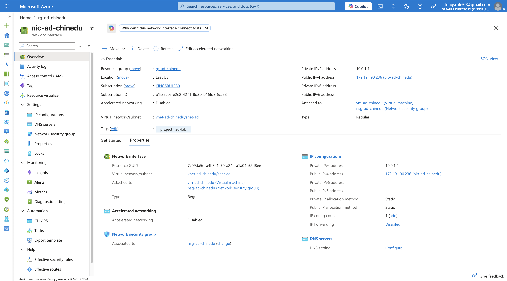

The NIC is attached to both `vm-ad-chinedu` and `nsg-ad-chinedu`, and the VNet/subnet path `vnet-ad-chinedu/snet-ad` confirms the full network topology is correctly wired.

---

### Phase 5 — RDP Connection as Domain User

I waited 10 minutes after `terraform apply` completed for the VM to finish rebooting after AD DS installation, then connected via Microsoft Remote Desktop on macOS. I configured the connection with PC name `172.191.90.236` and credentials `CORP\adadmin` — using the domain prefix format, not the local account syntax, to confirm domain authentication was functional.

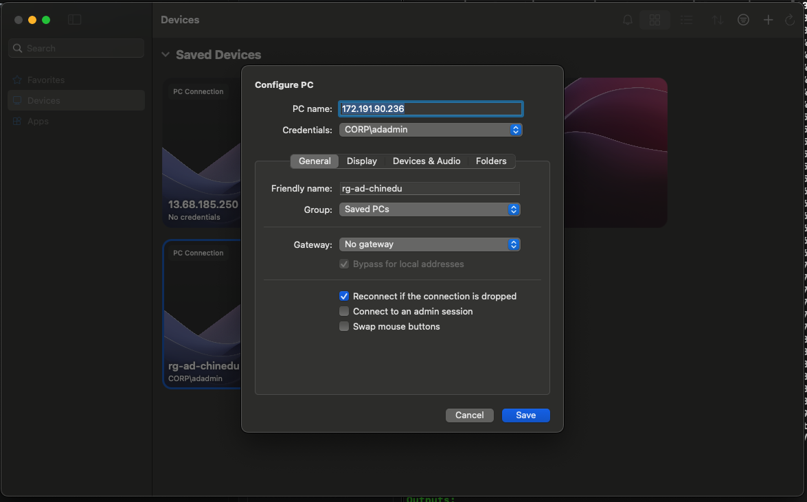

The Configure PC dialog shows PC name matching the terraform output IP, Credentials set to `CORP\adadmin`, and Friendly name `rg-ad-chinedu`. Authenticating as `CORP\adadmin` rather than `.\adadmin` is the key proof that the domain promotion succeeded — a local account prefix would indicate AD DS failed.

---

### Phase 6 — Server Manager & AD DS Verification

#### Server Manager Dashboard

On first login, Server Manager opened automatically. The dashboard confirms **AD DS** and **DNS** are both installed as server roles — visible in both the left navigation panel and the Roles and Server Groups tiles.

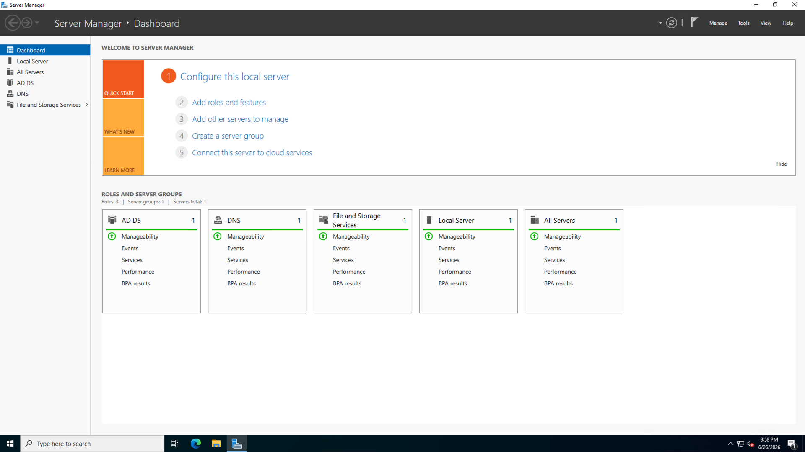

The dashboard shows `Roles: 3 | Server groups: 1 | Servers total: 1` — AD DS, DNS, and File and Storage Services all installed. Both AD DS and DNS tiles show green Manageability status, confirming the Custom Script Extension completed successfully and both roles are operational.

---

### Phase 7 — PowerShell Verification

I opened PowerShell as Administrator and ran four verification commands against the live domain to confirm every component of the AD DS deployment was functioning correctly.

#### NTDS Service Status

```powershell
Get-Service NTDS | Select-Object Name, Status
```

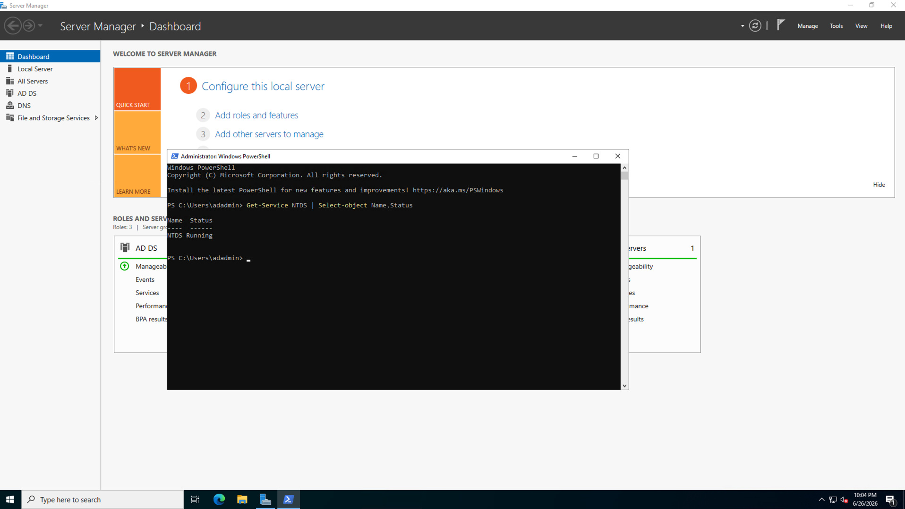

`NTDS Running` confirms the Active Directory Domain Services core service is operational. NTDS (NT Directory Service) is the database engine that stores all AD objects — if this service is not running, the domain controller is non-functional. The PowerShell prompt shows `PS C:\Users\adadmin>` confirming I am authenticated as the domain admin account.

#### Domain Configuration

```powershell
Get-ADDomain
```

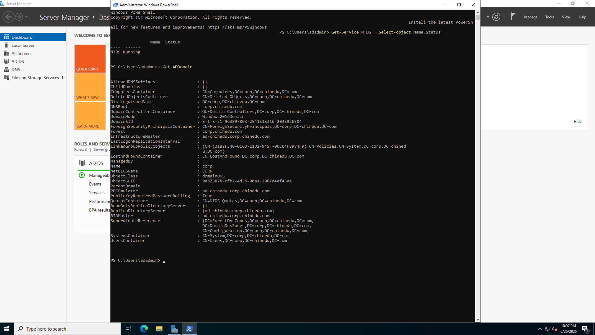

The full `Get-ADDomain` output confirms every key domain attribute: `DistinguishedName: DC=corp,DC=chinedu,DC=com`, `DNSRoot: corp.chinedu.com`, `DomainMode: Windows2016Domain`, `Forest: corp.chinedu.com`, `Name: corp`, `NetBIOSName: CORP`, and `PDCEmulator: ad-chinedu.corp.chinedu.com`. This output is the definitive proof that the forest was promoted correctly with all parameters matching the `terraform.tfvars` configuration.

#### Domain Controller Details

```powershell
Get-ADDomainController -Filter *
```

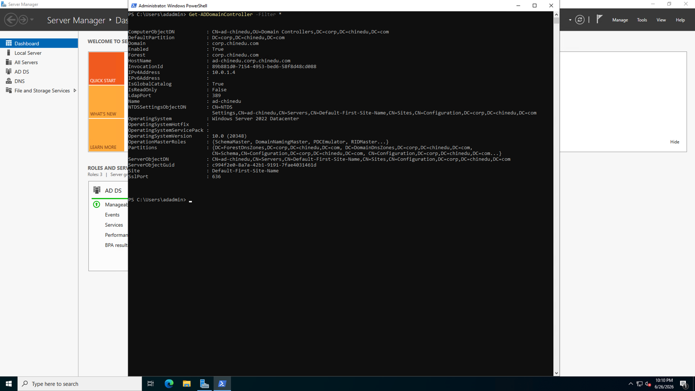

The domain controller record shows `Domain: corp.chinedu.com`, `HostName: ad-chinedu.corp.chinedu.com`, `IPv4Address: 10.0.1.4`, `IsGlobalCatalog: True`, `Name: ad-chinedu`, `OperatingSystem: Windows Server 2022 Datacenter`, and `OperationMasterRoles: {SchemaMaster, DomainNamingMaster, PDCEmulator, RIDMaster...}` — confirming all five FSMO roles are held by this domain controller as expected in a single-DC forest.

#### DNS Resolution

```powershell
Resolve-DnsName corp.chinedu.com
```

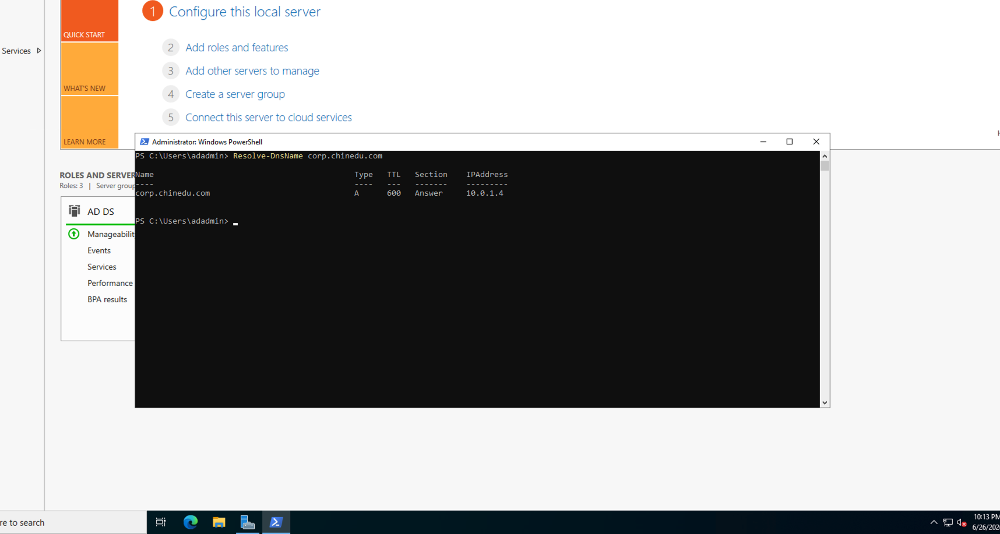

`corp.chinedu.com` resolves to `10.0.1.4` — the static private IP of the domain controller. Type A record, TTL 600, Section Answer confirms this is a live DNS response from the integrated DNS server, not a cached result. This validates the end-to-end DNS integration that AD DS requires to function correctly.

---

### Phase 8 — Terraform Outputs

I ran `terraform output` from the macOS terminal to capture the final state of all declared outputs — confirming the public IP, domain name, and admin username are all correctly surfaced by the Terraform configuration.

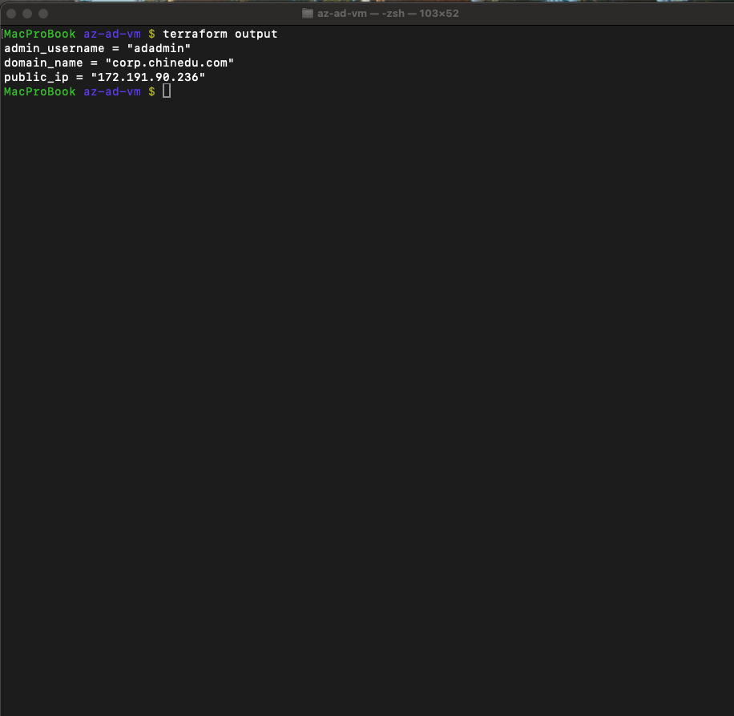

All three outputs match the deployed environment exactly: `admin_username = "adadmin"`, `domain_name = "corp.chinedu.com"`, `public_ip = "172.191.90.236"`. These outputs are what a downstream Terraform module or CI/CD pipeline would consume to connect to or extend this domain controller.

---

## 🧠 Skills Demonstrated

| Skill | Real-World Application |
|---|---|
| **Terraform IaC authoring** | Writing multi-resource Terraform configurations with variables, outputs, and provider version pinning — the standard pattern for enterprise Azure infrastructure pipelines |
| **Azure networking** | VNet, subnet, static public IP, NSG, and NIC configuration in code — understanding network topology is required for every Azure infrastructure role |
| **Static IP assignment** | Domain controllers require static private IPs for DNS record stability — demonstrating awareness of this requirement shows production-level thinking |
| **Custom Script Extension** | Automating post-deployment configuration without manual RDP intervention — the Azure-native pattern for bootstrapping VMs in IaC pipelines |
| **AD DS deployment** | Installing and promoting a domain controller via PowerShell — a core Windows Server administration skill required for identity and infrastructure roles |
| **FSMO role verification** | Confirming all five FSMO roles are held by the DC using `Get-ADDomainController` — demonstrates AD architecture knowledge beyond basic installation |
| **DNS integration validation** | Using `Resolve-DnsName` to confirm AD-integrated DNS is resolving the domain — required verification step for any DC deployment |
| **Secrets management** | Storing sensitive values in `terraform.tfvars` and excluding via `.gitignore` — basic but critical IaC security hygiene |
| **Terraform state management** | Running `terraform plan` before `terraform apply`, understanding outputs and state — fundamental Terraform operational discipline |

---

## 🎯 Career Relevance

| Role | How This Lab Applies |
|---|---|
| **Cloud Engineer** | Terraform is the primary IaC tool used by cloud engineering teams — this lab demonstrates end-to-end resource provisioning, variable management, and output handling against a real Azure subscription |
| **Azure Administrator (AZ-104)** | VM deployment, networking configuration, AD DS installation, and DNS validation are all AZ-104 exam competencies demonstrated here with real evidence |
| **Infrastructure Engineer** | Domain controller deployment and verification covers the core Windows Server infrastructure skills required for hybrid identity environments |
| **DevOps Engineer** | Terraform plan/apply workflow, `.gitignore` hygiene, and output-driven configuration represent foundational DevOps practices applicable to any CI/CD pipeline |
| **Identity Engineer** | AD DS forest promotion, FSMO role assignment, and domain admin credential management are core identity infrastructure skills for hybrid Entra ID environments |

---

## 🔐 Security Controls Implemented

| Control | Implementation | Outcome |
|---|---|---|
| **Secrets excluded from Git** | `terraform.tfvars` added to `.gitignore` | Passwords and domain credentials never committed to version control |
| **Sensitive variable flag** | `admin_password` and `dsrm_password` marked `sensitive = true` in `variables.tf` | Values masked in `terraform plan` and `terraform apply` output |
| **Static private IP** | NIC configured with `private_ip_address = "10.0.1.4"` | DNS records remain stable across VM reboots — required for DC reliability |
| **NSG scoping** | RDP restricted to port 3389 only — no other inbound rules | Minimal attack surface for lab RDP access |
| **DSRM password** | Separate from admin password, stored securely | AD recovery credentials isolated from operational credentials |
| **Domain credential authentication** | RDP connection uses `CORP\adadmin` not `.\adadmin` | Confirms domain auth is functional — local fallback not required |

---

## 📁 Repository Structure

```
azure-ad-terraform-lab/
│
├── README.md
├── terraform/
│   ├── main.tf
│   ├── variables.tf
│   ├── outputs.tf
│   └── .gitignore
└── screenshots/
    ├── architecture.png
    ├── 00-vscode-project-structure.png
    ├── 01-terraform-plan-top.png
    ├── 01-terraform-plan-summary.png
    ├── 02-terraform-apply-complete.png
    ├── 03-azure-resource-group.png
    ├── 04-nsg-rdp-rule.png
    ├── 05-nic-static-ip.png
    ├── 06-rdp-domain-login.png
    ├── 07-server-manager-ad-ds.png
    ├── 08-ntds-service-running.png
    ├── 09-get-addomain.png
    ├── 10-get-addomaincontroller.png
    ├── 11-dns-resolution.png
    └── 12-terraform-outputs.png
```

---

## 🔗 Related Labs

| Lab | Description |
|---|---|
| **[Azure Governance & Policy Lab](https://github.com/kingsrule50/azure-governance-policy-lab)** | Enterprise Azure governance framework — custom JSON policies, initiative bundles, compliance monitoring, and resource locks |
| **[Conditional Access & MFA Lab](https://github.com/kingsrule50/conditional-access-mfa-lab)** | Layered Conditional Access architecture — MFA enforcement and Tor-based risk detection in Microsoft Entra ID |
| **[Azure SOC Homelab](https://github.com/kingsrule50/azure-soc-homelab)** | Splunk SIEM on Azure — AD log ingestion, SPL detection rules, and automated brute-force alerting |
| **[Privileged Identity Management Lab](https://github.com/kingsrule50/privileged-identity-management-pim-lab)** | Just-In-Time privileged access control using Microsoft Entra PIM — time-bound Global Admin eligibility and audit logging |
| **[Windows Autopilot & Intune Lab](https://github.com/kingsrule50/windows-autopilot-intune)** | Zero-touch Windows deployment pipeline using Microsoft Intune and Entra ID |

---

## 📚 References

- [Terraform AzureRM Provider Documentation](https://registry.terraform.io/providers/hashicorp/azurerm/latest/docs)
- [Azure Virtual Machines — Terraform](https://registry.terraform.io/providers/hashicorp/azurerm/latest/docs/resources/windows_virtual_machine)
- [Custom Script Extension for Windows](https://learn.microsoft.com/en-us/azure/virtual-machines/extensions/custom-script-windows)
- [Install-ADDSForest PowerShell Reference](https://learn.microsoft.com/en-us/powershell/module/addsdeployment/install-addsforest)
- [Active Directory Domain Services Overview](https://learn.microsoft.com/en-us/windows-server/identity/ad-ds/get-started/virtual-dc/active-directory-domain-services-overview)
- [AZ-104 Azure Administrator Certification](https://learn.microsoft.com/en-us/credentials/certifications/azure-administrator/)
- [HashiCorp Terraform Associate Certification](https://www.hashicorp.com/certification/terraform-associate)

---

<div align="center">

**Chinedu Kingsley Asuzu**
Cloud Security Engineer · Microsoft Azure · Infrastructure as Code

*Part of a hands-on cloud security lab series · Microsoft Azure Developer Tenant*

</div>
